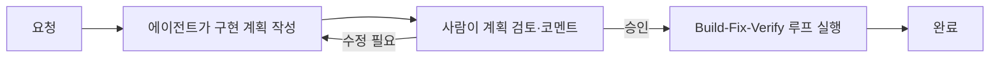
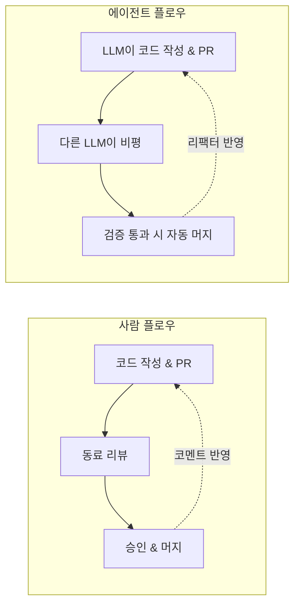
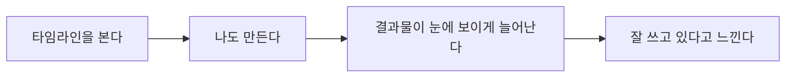
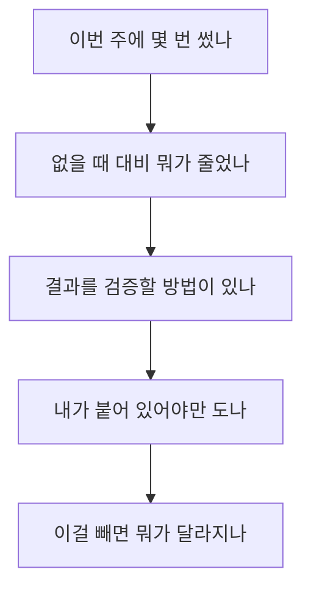
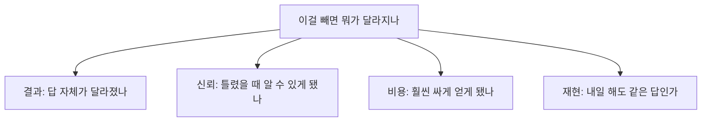
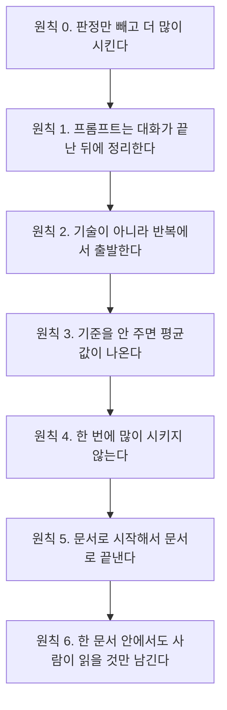

GDG Korea Android에서 두 발표를 들었습니다. 1교시는 Daniele Bonaldo(Google Developer Expert, Android)의 "The Good Stuff, Not the Slop", 2교시는 하동현님(Android 9년차)의 "AI를 잘 쓰고 있다는 착각, 그리고 그걸 확인하는 법"이었습니다. 둘 다 결이 비슷했습니다. AI로 빨라지는 건 맞는데, 그 속도를 어떻게 검증하고 어디에 선을 그을 것인가.

## 1교시 — The Good Stuff, Not the Slop

### 제약 없는 AI가 만드는 것

Bonaldo는 먼저 "Vibe Coder"의 부상을 짚었습니다. 제약 없이 AI에 맡기면 생기는 문제는 이렇습니다.

- 프로젝트 맥락 없이 모델의 오래된 학습 데이터에 있는 패턴을 그대로 제안한다 (`AsyncTask`, `Thread.run`, raw Volley 호출 같은 레거시)
- 컴파일은 되지만 MVI, Clean Architecture, Hilt 같은 현대적 패턴은 무시한다
- 결과적으로 한 코드베이스 안에 다섯 명이 열 가지 아키텍처로 짠 것 같은 일관성 붕괴가 생긴다

### 운전석은 사람이 잡는다

해법은 속도를 유지하되 구조적 규율을 강제하는 것입니다. AI의 역할과 허용 기술을 제한하고 파일을 고치기 전에 계획을 먼저 검토·승인받고 매 단계마다 빌드와 린트와 테스트로 검증합니다.

이 규율의 첫 번째 도구가 `AGENTS.md`입니다. 역할, 기술 스택, "이건 절대 건드리지 마라" 같은 제약을 담는 전역 규칙 파일입니다.

```
## Role
You are an expert Android Engineer prioritizing Kotlin, Jetpack Compose, and Material 3.

## Tech Stack
- UI: Compose with StateFlow (MVI/MVVM)
- Dependency Injection: Hilt
- Local Db: Room

## Constraints
- DO NOT modify existing audio/video flows.
- DO NOT expose secrets/API keys.
```

두 번째 도구는 Android Studio의 Planning Mode입니다. 에이전트가 여러 파일에 걸친 구현 계획을 코드 한 줄 쓰기 전에 먼저 세우고 사람이 그 계획에 코멘트를 달아 반복한 뒤에야 build-fix-verify 루프가 돌아갑니다.



### AGENTS.md와 SKILL.md는 역할이 다르다

이 둘을 헷갈리면 안 됩니다.

| 항목 | AGENTS.md (Rules) | SKILL.md (Skills) |
|---|---|---|
| 적용 범위 | 전역, 매 프롬프트마다 | 작업 단위, 필요할 때만 |
| 목적 | 아키텍처와 가드레일 | 절차적 워크플로우 |
| 컨텍스트 비용 | 매 세션 턴마다 전송 | Progressive disclosure로 로드 |
| 대상 작업 | 코드 스타일, 스택, 제외 대상 | API 마이그레이션, 감사, 셋업 |

`SKILL.md`는 `name`, `description`, `metadata` 같은 YAML 메타데이터와 지시문으로 구성된 표준 포맷이고 `scripts/`, `references/`, `assets/` 폴더를 같이 묶을 수 있습니다. Android CLI로 `android skills add --skill=r8-analyzer --project=.` 처럼 관리합니다. 공식 Preloaded Studio Skills로는 XML→Compose 마이그레이션, AGP 9 DSL 업그레이드, Navigation 3, R8 설정 감사, Edge-to-Edge 대응 같은 것들이 이미 나와 있습니다.

MCP는 이 에이전트를 GitHub, Figma, Jira 같은 외부 툴체인에 연결하는 프로토콜입니다. AppFunctions는 Android 16의 OS 레벨 API로 앱 기능(메모 생성 등)을 AICore를 통해 완전히 온디바이스에서 Gemini 같은 시스템 어시스턴트에 노출합니다.

### 파워유저 패턴 세 가지

Session Isolation은 기능마다 새 대화 스레드로 시작합니다. 이전 작업의 맥락이 새는 것을 막고 토큰 낭비도 줄입니다.

Agent Loops는 세 종류로 나뉩니다. Turn-based는 사람과 에이전트가 번갈아 개입하는 대화형, Goal-based는 계획-실행-평가를 스스로 반복하는 자가수렴형, Proactive는 백그라운드에서 계속 모니터링하다 이벤트가 생기면 먼저 움직이는 형태입니다.

Adversarial Code Review는 한 LLM이 코드를 쓰고 다른 모델이 비평가 역할로 커밋 전에 검수하게 만듭니다.



`CodeRabbit`이 AI가 낸 PR을 자동으로 리뷰해주고 오픈소스 `pr-review-relay`는 여러 CLI 에이전트에 동시에 리뷰를 맡겨 각자 PR 코멘트로 결과를 남기게 합니다. DIY로 하려면 "커밋 단위 작업마다 다른 모델로, 캐시 없는 깨끗한 컨텍스트에서 adversarial review를 수행하라"는 한 줄 프롬프트로도 됩니다.

발표는 Android Bench(`developer.android.com/bench`)도 짚었습니다. 모델별로 실제 Android 개발 과제를 시켜서 점수·비용·지연시간을 재는 벤치마크인데, 발표 시점 기준 Claude Opus 5가 91.8%로 1위였습니다.

마무리는 이랬습니다. 만능 도구는 없으니 `AGENTS.md`와 skill을 팀 컨벤션에 맞게 직접 다듬을 것, AI에게는 뼈대(보일러플레이트, 테스트 스텁, API 마이그레이션)를 맡기고 사람은 아키텍처와 창의적 결정을 맡을 것. "AI won't replace Android developers (yet). Developers who use AI will replace those who don't."

## 2교시 — AI를 잘 쓰고 있다는 착각, 그리고 그걸 확인하는 법

### 착각은 어떻게 만들어지는가

하동현님은 짧은 이야기로 시작했습니다. 1980년 사무실에 PC가 들어왔을 때 "이제 회계사는 없어지겠다"고 했지만 지금 회계사는 그때보다 많습니다. 일자리가 없어진 게 아니라 일하는 방식이 바뀐 것이고 같은 도구 앞에서도 갈린 쪽이 있었습니다. 숫자만 채워 넣을 줄 알았던 쪽과, 그 도구로 사업 계획을 세울 줄 알았던 쪽.

우리는 지금 그 갈림길에 있다는 게 발표의 전제입니다. 그리고 우리가 "AI를 잘 쓰고 있다"고 느끼는 과정은 대개 이런 경로를 거칩니다.



문제는 이 네 번째 단계를 검증한 적이 없다는 것입니다. 이게 정말 내가 잘 써서 된 건지, 아니면 그냥 모델이 좋아진 건지 한 번도 나눠본 적이 없습니다. 차이는 실재하지만 내년이면 모델이 따라잡아 사라질 차이인지 그때도 남을 차이인지 구분하지 않으면 어느 쪽이 어느 쪽인지 알 도리가 없습니다.

### 착각의 두 가지 형태

첫 번째는 "만들 때가 제일 재미있다"는 것입니다. 들인 공은 성능까지 재서 개선할 만큼 컸는데, 지금 쓰는 정도는 거의 0에 가깝습니다. 성능이 나빠서가 아니라 그 일 자체가 자주 안 생기기 때문입니다. 품질과 사용 여부는 별개입니다.

그렇다고 만들지 말라는 얘기는 아닙니다. 만들기 전에 물을 건 두 가지뿐입니다. 이걸 몇 번 쓸 건가, 그리고 만들면서 뭘 처음 해보나. 둘 중 하나만 답할 수 있어도 만듭니다. 도구가 결국 안 쓰여도 배운 건 남으니까요. 둘 다 "글쎄"면 안 만듭니다. 이미 아는 방식으로 하나 더 찍어내는 것뿐이고, 그러면 정말 목록만 늘어납니다.

두 번째는 "손에 익은 곳부터 자동화한다"는 것입니다. 실제로 자동화한 곳은 코드, 제일 손에 익은 자리였습니다. 그런데 정작 늦어지던 곳은 대기였습니다. 기획이 안 정해져서, 뭐가 되는지 몰라서 물어보고 기다리는 시간. 늦어지던 쪽은 내 영역이 아니라고 생각해서 안 건드렸을 뿐, 이미 빠른 곳을 더 빠르게 만들고 있었던 셈입니다.

### 판별 질문 다섯

느낌 말고 근거를 갖고 정하려면 무엇을 봐야 하는지가 필요합니다. 다섯 가지 질문 중 하나라도 "글쎄"면, 그건 아직 도구가 아닙니다.



안 쓰면 없는 겁니다. 품질과 사용 여부는 별개입니다. "편해졌다"는 느낌만 있고 줄어든 게 없으면 도구가 아니라 취미입니다. 내가 봐줘야만 돌아가면 그것도 도구가 아니라 내 습관입니다.

세 번째 질문, 결과를 검증할 방법이 있나가 특히 중요하게 다뤄졌습니다. AI 결과는 틀려도 그럴듯한 게 기본값이기 때문입니다. 기획자가 "이거 서버에서 되나요"라고 물을 때 도구가 판정하고 나는 그 자리에 없다면, 아는 척 잘하게 만드는 것보다 모르는 걸 모른다고 말하게 만드는 것이 핵심 산출물이어야 합니다. 아는 척하면 틀려도 그럴듯해서 그 자리에 틀렸다고 말해줄 사람이 없습니다. "확인 필요"라고 말할 수 있게 만드는 것 자체가 목표입니다.

다섯 번째 질문, 이걸 빼면 뭐가 달라지나는 네 축으로 나눠서 봐야 거칠지 않습니다.



넷 중 하나라도 달라졌으면 내 몫입니다. 하나도 안 달라지면, 그건 모델이 원래 하고 있던 일입니다.

### 일곱 가지 원칙

"이거 어때?"라고 물은 순간 좋고 나쁨의 기준을 이미 넘긴 것이라는 지적이 원칙의 출발점입니다. "괜찮은지 봐줘", "내 생각 맞아?"도 마찬가지입니다. 셋 다 빈손으로 물었고, 그러면 기준까지 AI에게 같이 넘어갑니다. 발표가 제시한 일곱 가지 원칙은 전부 여기서 나옵니다.



원칙 0은 나머지 여섯 개가 갈라져 나오는 뿌리입니다. 선택지를 넓히거나("다른 방식 3개를 내고 각각 뭘 포기했는지 적어줘"), 내 기준을 적용시키거나("이 기준으로 전부 훑고 어긋난 데를 짚어줘"), 내 판단을 반박시키는("나는 A로 정했다. 이게 틀렸다면 왜인지 찾아줘") 세 가지 모두 내가 먼저 뭔가를 정한 다음에 시킵니다. 셋째가 특히 그런데, 내가 만든 걸 내가 재면 반드시 유리하게 재기 때문입니다.

원칙 1은 프롬프트를 처음부터 잘 쓰려고 하지 않는 것입니다. 짧게 던지고 결과를 보고 틀린 데를 그때그때 짚고, 몇 번 반복한 뒤에야 "지금까지 맞춘 내용을 다음에 그대로 쓸 수 있는 프롬프트로 정리해줘"라고 시킵니다. AI는 자기가 어디서 헷갈렸는지 예측해서 미리 막는 것보다, 겪은 다음에 적는 걸 더 잘합니다.

원칙 2는 세는 단위 얘기이기도 합니다. 새 기능이 나왔을 때가 아니라 문서가 쌓여서 못 찾겠다거나 규칙을 적었는데 안 지켜진다는 짜증에서 시작한 것들이 살아남았습니다. 그리고 "내가 반복하는 일"이 아니라 "내 앞에서 반복되는 일"을 세야 합니다. 내가 하는 일만 세면 내 손에 익은 것만 나오지만 앞에서 반복되는 걸 세면 남이 나한테 계속 물어보는 것도 목록에 들어옵니다.

원칙 3은 디자인에서 가장 명확히 보였습니다. "이런 앱 화면 만들어줘"만 던지면 어디서 본 것 같은 화면이 나옵니다. 못 만든 게 아니라 가장 흔한 답을 넣은 겁니다. 누가 쓰나, 어떤 느낌이어야 하나 하는 이야기가 먼저 나오고, 색과 여백이 왜 그런지를 정하는 디자인 시스템이 그다음에 나와야, 마지막 화면이 같은 모델로도 완전히 달라집니다. 티가 나는 자리는 거의 둘, 여백과 문구였습니다.

원칙 4는 양쪽 끝이 다 함정이라는 이야기입니다. 너무 크게 시키면 내가 다 못 읽고 너무 잘게 쪼개면 맥락을 매번 다시 설명해야 해서 그게 더 비쌉니다. 알맞은 크기면 틀려도 그 덩어리만 버리면 됩니다.

원칙 5는 문서로 시작해서 문서로 끝내는 것입니다. spec으로 무엇을 만들지 고정하고 plan으로 PR 단위로 순서를 쪼개고, 구현은 한 덩어리씩 내가 다 읽을 수 있는 크기로 진행하고, 진척은 같은 문서에 다시 기록됩니다. 새 대화를 열어도 이 문서만 주면 이어서 일합니다. 기록이 아니라 인수인계입니다. 다음에 읽는 게 내가 아니라 다음 세션의 AI일 수 있기 때문입니다.

원칙 6은 같은 문서 안에서도 코드 위치(파일, 줄, 심볼)는 판단 재료가 아니니 접어서 내려두라는 것입니다. 지운 게 아니라 접은 것이라 검색은 그대로 됩니다.

### 남의 방식을 그대로 쓰면

규칙 파일이나 스킬, 훅은 잘 만든 구성일수록 공유되기 쉽습니다. 하지만 그걸 그대로 가져오면 안 맞을 때 못 고칩니다. 내가 왜 그렇게 하는지 모르기 때문입니다. 이것도 결국 타임라인을 보고 따라 만드는 것이라, 발표 맨 앞에서 짚은 그 자리로 돌아옵니다.

### 추인과 판단

"사람은 판단에 들어간다"는 말은 듣기엔 좋지만, 판단하려면 먼저 알아야 합니다. 기준이 있으면 이미 뭘 볼지 알고 있으니 물을 이유가 없습니다. 기준이 없으면 왜 괜찮은지 모르면서 도장만 찍는 추인이 되고, 그래서 "이거 어때?"라고 묻게 됩니다. 기준을 남에게 넘기는 건 대개 넘길 기준이 없어서 생깁니다. 그래서 시간을 코드를 빨리 짜는 연습이 아니라 설계를 보는 눈을 기르는 쪽으로 옮겼다고 합니다.

그 눈은 잘하는 분야에서는 잘 안 길러집니다. 안드로이드처럼 내가 잘하는 분야는 손으로 고쳐버리기 때문에, 결과물은 괜찮게 나와도 AI를 잘 쓴 건지 내가 고쳐서인지 구분이 안 됩니다. 반대로 디자인이나 영상처럼 내가 못하는 분야는 고칠 수가 없어서 오로지 어떻게 다루느냐로만 결과가 갈리는 유일하게 순수한 연습 환경이 됩니다. 열 번을 시켜야 나오는 쪽에서, 어떻게 말해야 원하는 게 나오는지를 배우게 됩니다.

발표는 이렇게 정리하며 끝났습니다. 빨라진 게 아니라 빨라진 것처럼 보이는 상태가 된 걸 수도 있습니다. 안 보고 넘어간 것들이 쌓이면 그렇게 됩니다. 모델이 따라잡기 어려운 자리는 셋, 무엇을 만들지 정하는 것, 나온 결과가 맞는지 판별하는 것, 무엇을 남길지 고르는 것입니다. 도구는 계속 바뀌지만 안 바뀌는 건 무엇을 받아들일지 정하는 자리라는 게 마지막 문장이었습니다.

