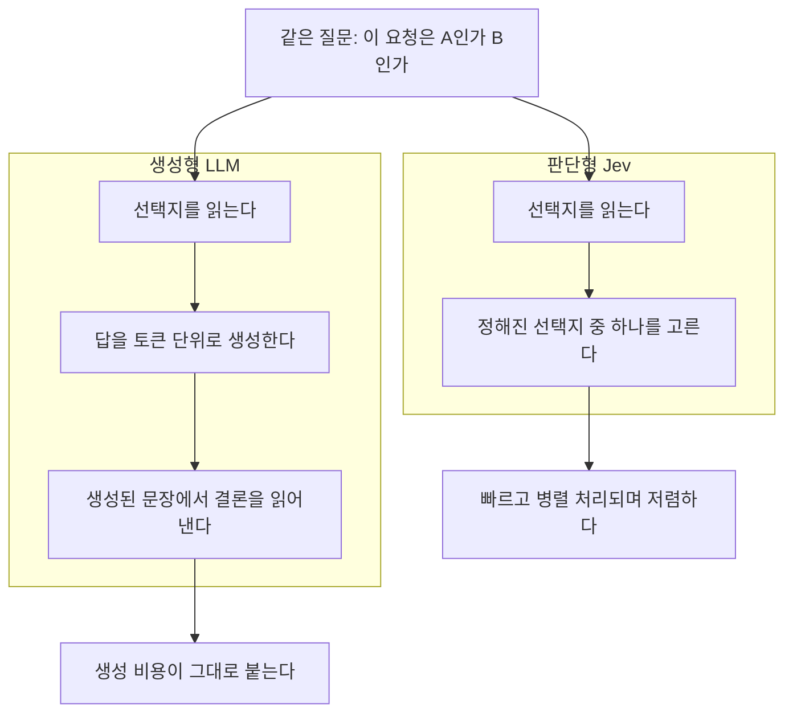

Jev에 대한 이야기로 뜨겁습니다. TypeSafe AI가 낸 모델인데 소개가 좀 특이했습니다. 생성형이 아니라 판단형이라는 겁니다.

## 판단만 하는 모델

LLM은 기본적으로 다음 토큰을 만들어내는 기계입니다. 분류나 선택을 시켜도 결국 답을 문장으로 생성합니다. 그래서 "이 요청이 A인가 B인가" 같은 단순한 판단에도 생성 비용이 그대로 붙습니다.

Jev는 그 지점을 떼어냈습니다. 정의된 rule과 선택지 안에서 결정을 내리는 데 특화되어서 빠르고 병렬 처리가 되고 비용이 낮습니다. TypeSafe는 이걸 System One 모델이라고 부릅니다. 사람으로 치면 숙고하는 사고가 아니라 반사적으로 판단하는 쪽입니다.



같은 질문을 두고도 거치는 단계가 다릅니다. 생성형은 답을 문장으로 만들어낸 뒤 거기서 결론을 읽어내야 하지만, 판단형은 선택지 중 하나를 바로 집습니다. 중간에 낀 생성 단계가 비용과 속도의 차이를 만듭니다.

쓸모를 가늠해보면 이런 자리들이 떠오릅니다. 데이터 라벨링, 요청 라우팅, 스팸이나 이상치 필터링처럼 후보가 정해져 있고 그중 하나를 고르면 되는 작업입니다. 규칙으로 짜기엔 입력이 자연어라 애매하고, LLM을 부르자니 과한 영역입니다.

## Claude Code에 붙인 사례

며칠 뒤 Claude Code용 mod로 나온 걸 봤습니다. 이게 Jev의 성격을 잘 보여줍니다.

Claude Code는 설치된 스킬의 이름과 description을 세션마다 모델에게 전부 보냅니다. 스킬 하나당 한 줄인데, 프롬프트가 그 스킬과 상관없어도 목록은 그대로 들어갑니다. 대여섯 개일 땐 신경 쓸 일이 아니지만 프로젝트 스킬, 플러그인이 딸려 오는 스킬, 개인 전역 스킬이 겹치면 금세 수십 줄이 됩니다. 매 세션 고정으로 나가는 비용입니다.

`jev-skill-suggestion` mod는 이 목록을 모델에게 보내지 않습니다. 대신 프롬프트마다 Jev가 description들을 읽고 최대 하나를 고른 뒤, 그 스킬의 `SKILL.md`만 붙여줍니다. 스킬은 그대로 설치돼 있어서 `/이름`으로 직접 부르는 건 계속됩니다.

스킬을 고르는 건 생성이 필요 없는 문제입니다. 후보가 정해져 있고 하나를 고르거나 전부 기각하면 됩니다. 딱 판단형 모델이 들어갈 자리입니다.

효과도 숫자로 나와 있습니다. TypeSafe가 공개한 cookbook 기준으로 스킬 182개 환경에서 잘못된 로드가 16.8%에서 7.3%로, 불필요한 로드가 9.8%에서 4.0%로 줄었습니다.

## 어떻게 써보나

설치는 한 줄입니다.

```sh
npx claude-code-templates@latest --mod productivity/jev-skill-suggestion
```

실행은 플래그가 필요합니다. function hooks가 아직 early access라서입니다.

```sh
CLAUDE_CODE_ENABLE_FUNCTION_HOOKS=1 claude
```

**API 키는 없어도 됩니다.** 키가 없으면 Claude Code 내장 분류기로 폴백해서 동작합니다. 정확도는 떨어지지만 스킬 목록을 컨텍스트에서 빼는 절약은 그대로입니다. TypeSafe API 키나 Vercel AI Gateway 키를 넣으면 Jev 본체를 쓰고 TypeSafe 쪽은 답변마다 신뢰도까지 같이 줍니다.

이 차이가 생각보다 중요합니다. 키를 넣는 순간 매 프롬프트가 외부 API로 나갑니다. 회사 코드를 다루는 환경이라면 그냥 넘어갈 문제가 아닙니다. 키 없이 쓰면 외부 전송이 없으니 정책이 걸릴 때 선택지가 됩니다.

직접 깔아보면서 걸린 것도 몇 개 있었습니다. 설치가 전역이 아니라 명령을 실행한 디렉터리의 `.claude/`로 들어갑니다. 그 자리가 git 저장소면 untracked로 잡히니 gitignore에 넣든 전역으로 옮기든 정하고 넘어가는 게 좋습니다. 그리고 설치만으로는 절약이 눈에 보이지 않습니다. README가 안내하는 setup 커맨드를 돌려야 합니다. 이게 사용자 설정 파일을 건드리니 권한이나 훅을 손수 쌓아둔 설정이라면 백업을 먼저 떠두는 편이 낫습니다.

## 쓸지 말지

스킬 개수에 달려 있습니다.

cookbook 수치가 182개 기준이라는 걸 감안해야 합니다. 실제로 손에 익어 쓰는 스킬이 대여섯 개라면 아끼는 컨텍스트보다 잃는 게 큽니다. 스킬이 숨겨지면 자연어로 자동 발동하던 흐름이 Jev의 판정을 한 번 거치게 되기 때문입니다. 트리거 조건을 공들여 적어둔 스킬일수록 체감이 클 겁니다.

반대로 플러그인을 여럿 붙였거나 팀 공용 스킬까지 얹혀 목록이 수십 줄을 넘겼다면 시도해볼 만합니다. README도 이 점을 알아서 목록을 남긴 채 제안만 얹어보고 모델이 스스로 고르던 것과 비교한 다음 목록을 빼라고 권합니다. 순서가 합리적입니다.

다만 mod 자체보다 판단형 모델이라는 방향이 더 눈에 들어왔습니다. 스킬 선택은 그중 한 사례일 뿐이고, 팀에서 "이건 LLM까지는 필요 없는데" 싶었던 판단들이 떠오른다면 같은 자리에 넣어볼 수 있습니다. 라벨링이든 라우팅이든 필터링이든 마찬가지입니다.
