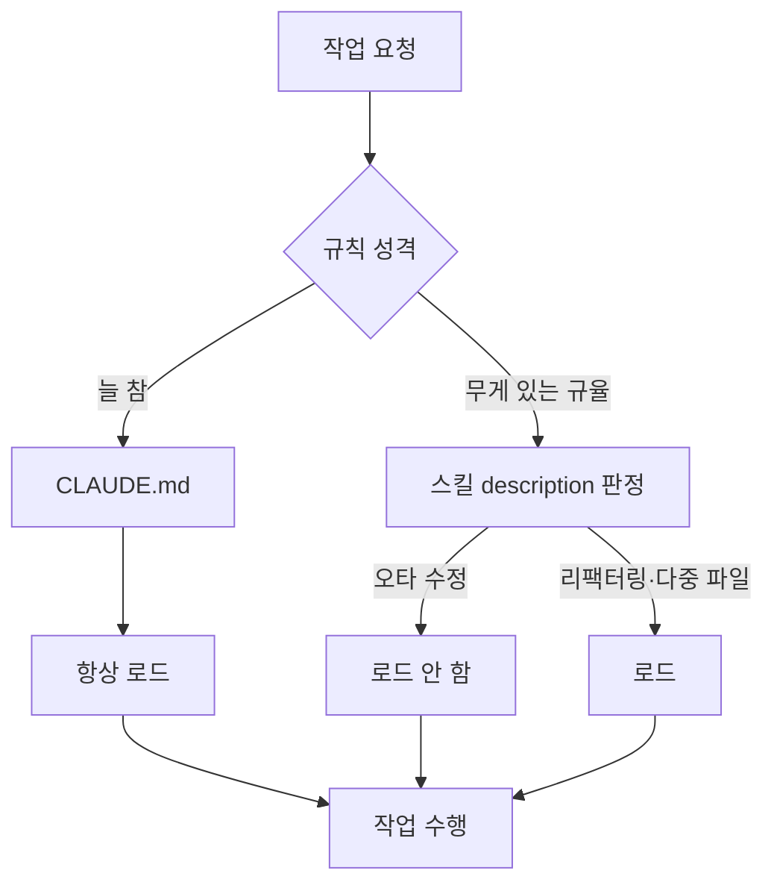

[andrej-karpathy-skills](https://github.com/multica-ai/andrej-karpathy-skills)는 `CLAUDE.md` 파일 하나가 전부인 저장소입니다. Andrej Karpathy가 LLM으로 코딩할 때 반복적으로 겪는 문제들을 지적한 내용을 행동 규칙으로 옮겨놓았습니다. 2026년 1월에 만들어져 별 20만 개, 포크 2만 개를 넘겼습니다.

규칙은 네 갈래입니다.

- **코딩 전에 생각하라** — 가정을 명시하고, 해석이 여러 개면 하나를 조용히 고르지 말고 다 꺼내놓고, 불명확하면 멈추고 물어라
- **단순함 우선** — 요청하지 않은 기능·추상화·설정 가능성을 만들지 마라. 200줄 짰는데 50줄로 되면 다시 써라
- **외과적 수정** — 요청한 것만 건드려라. 옆 코드를 "개선"하지 말고 기존 스타일을 따라라. 관련 없는 죽은 코드는 발견하면 말만 하고 지우지 마라
- **목표 기반 실행** — "검증 실패하는 테스트를 먼저 쓰고 통과시켜라" 식으로 검증 가능한 형태로 바꿔라

## 문제는 규칙이 아니라 항상 켜져 있다는 점

저장소는 스스로 단서를 답니다.

> 이 가이드라인은 속도보다 신중함 쪽으로 치우칩니다. 사소한 작업에는 판단해서 쓰세요.

문제가 여기 있습니다. `CLAUDE.md`는 세션이 열릴 때마다 통째로 읽힙니다. "판단해서 쓰라"고 적어둬도, 오타 하나 고치는 작업에까지 가정 명시와 계획 수립과 테스트 우선이 따라붙습니다. 규칙을 지키면 배보다 배꼽이 커지고, 무시하면 규칙을 적어둔 의미가 없어집니다.

## 저장소는 이미 답을 담고 있다

파일 목록을 보면 같은 내용이 두 벌 들어 있습니다. `CLAUDE.md`, 그리고 `skills/karpathy-guidelines/SKILL.md`. 중복처럼 보이지만 로딩 방식이 다릅니다.

```yaml
---
name: karpathy-guidelines
description: Behavioral guidelines to reduce common LLM coding mistakes.
  Use when writing, reviewing, or refactoring code to avoid overcomplication,
  make surgical changes, surface assumptions, and define verifiable success criteria.
---
```

`CLAUDE.md`는 항상 로드되지만, 스킬은 **description이 지금 작업과 맞을 때만** 로드됩니다. "사소한 작업에는 굳이"라는 문제를 파일을 갈아끼워서가 아니라 description이 게이트 역할을 하도록 설계해 푼 셈입니다.

## 두 층으로 나누기

그래서 규칙을 성격에 따라 나눠 넣는 게 좋습니다.

| | CLAUDE.md (항상) | 스킬 (조건부) |
|---|---|---|
| 담을 것 | 작업 크기와 무관하게 늘 참인 것 | 규율·절차처럼 무게가 있는 것 |
| 예 | 기밀 유지, 배포 규칙, 디자인 시스템 | 가정 명시, 계획 수립, 테스트 우선 |
| 어길 때 | 사고가 남 | 시간이 아깝게 감 |



핵심은 description을 쓰는 방식입니다. Codex 문서도 같은 이야기를 합니다 — 컨텍스트가 모자라면 description이 잘리므로 **핵심 용도와 트리거 단어를 앞쪽에 배치**해야 자동 선택이 안정적으로 걸립니다. "리팩터링, 다중 파일 변경, 아키텍처 결정 시"처럼 적어두면 오타 수정에는 붙지 않습니다. 필요하면 이름으로 직접 부를 수도 있습니다.

## 세션을 미리 나누는 방식은 권하지 않는다

"간단한 작업용 세션"과 "복잡한 작업용 세션"을 따로 만들어 서로 다른 규칙 파일을 보게 하는 구성도 떠올릴 수 있습니다. 두 가지 이유로 추천하지 않습니다.

**작업 성격은 하다가 바뀝니다.** 이 블로그를 만들면서 겪은 것만 봐도 그렇습니다. 스크롤바 색만 바꾸려던 작업에서 메모 카드가 깨지는 원인을 찾다가 HTML 중첩 링크 문제가 나왔고, 카드 여백을 보다가 `[hidden]` 속성이 사이트 전역에서 무력화돼 관리자 버튼이 모든 방문자에게 노출되던 것을 발견했습니다. "간단 세션"에 들어가 있었다면 규율이 필요해진 시점에 규율이 없는 상태였을 겁니다.

**분류 자체가 비용입니다.** 세션을 나누면 매번 어느 쪽으로 들어갈지 판단해야 하고, 지금 어느 모드인지 기억해야 하는 상태가 생깁니다. 스킬 방식은 그 판단을 description에 위임해서 상태를 없앱니다.

워크트리는 규칙을 분리하려고 쓰는 도구가 아니라, 병렬 작업이 서로의 파일을 밟을 때 쓰는 도구입니다.

## Codex에도 그대로 옮겨진다

Codex는 `AGENTS.md`가 `CLAUDE.md`에 대응합니다. 전역은 `~/.codex/AGENTS.md`, 프로젝트는 저장소 루트부터 현재 디렉터리까지 내려가며 찾고 가까운 파일이 우선합니다. 마크다운 산문이라 변환 없이 복사해도 동작합니다.

스킬은 더 간단합니다. Codex도 Claude Code와 같은 [Agent Skills 공개 표준](https://agentskills.io)을 쓰기 때문에 `SKILL.md` 형식이 동일합니다. 저장 위치만 다릅니다.

| 범위 | 경로 |
|---|---|
| 저장소 | `.agents/skills` |
| 사용자 | `~/.agents/skills` |
| 시스템 | `/etc/codex/skills` |

호출은 `$skill-name`으로 직접 하거나, description이 맞으면 Codex가 알아서 고릅니다. 설치는 Codex 안에서 `$skill-installer`를 씁니다.

찾아보실 때 주의할 점이 하나 있습니다. 예전 공식 카탈로그였던 `openai/skills` 저장소는 현재 deprecated 상태이고 `openai/plugins`로 옮겨갔는데, 검색하면 아직 옛 저장소를 안내하는 글이 많이 나옵니다.

## 정리

규칙집을 받아서 `CLAUDE.md`에 통째로 붙이는 게 가장 쉬운 선택이지만, 그 순간부터 모든 작업이 같은 무게를 지게 됩니다. 저장소가 스킬 버전을 따로 넣어둔 이유가 거기에 있습니다.

- 어겼을 때 **사고가 나는 것**만 `CLAUDE.md`에 남긴다
- 어겼을 때 **시간이 아까운 것**은 스킬로 내리고, description으로 언제 켤지 정한다
- 세션을 미리 나누지 않는다 — 작업이 커지면 그때 규율이 붙는 편이 낫다
