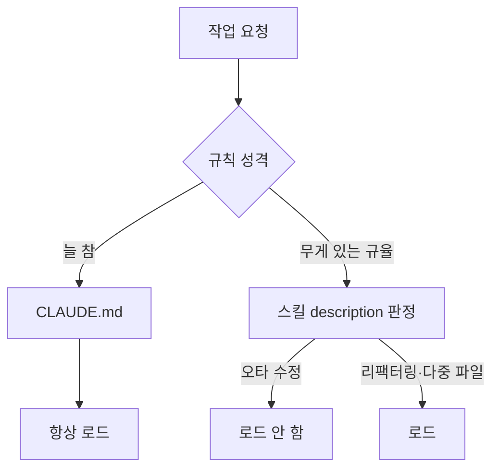

[andrej-karpathy-skills](https://github.com/multica-ai/andrej-karpathy-skills)는 `CLAUDE.md` 파일 하나가 전부인 저장소입니다. Andrej Karpathy가 LLM으로 코딩할 때 반복적으로 겪는 함정을 지적한 내용을 행동 규칙으로 옮겨놓았습니다. 2026년 1월에 만들어져 별 20만 개, 포크 2만 개를 넘겼습니다.

읽어보면 네 갈래인데, 하나하나가 LLM이 실패하는 서로 다른 방식을 겨냥합니다.

## 1. 코딩 전에 생각하라

> 가정하지 마라. 혼란을 숨기지 마라. 트레이드오프를 꺼내놓아라.

LLM은 모르는 것을 만나도 잘 멈추지 않습니다. 빈칸을 그럴듯한 값으로 채우고 계속 갑니다. 저장소의 예시가 이걸 잘 보여줍니다. "사용자 데이터 내보내기 기능 추가해줘"라는 한 줄에 대해, 곧장 `export_users()`를 써 내려가면서 조용히 네 가지를 정해버립니다 — 전체 사용자를 다 내보낼지, 파일을 어디에 쓸지, 어떤 필드를 포함할지, CSV 컬럼은 무엇일지.

문제는 코드 품질이 아니라 **결정이 보이지 않는다**는 점입니다. 개인정보가 걸린 "전체 사용자"를 임의로 골랐는데 그 선택이 어디에도 드러나지 않습니다.

규칙이 요구하는 건 이렇습니다.

- 가정을 밖으로 꺼낼 것. 확신이 없으면 물을 것
- 해석이 여러 개면 하나를 조용히 고르지 말고 다 제시할 것
- 더 단순한 방법이 있으면 말할 것. 필요하면 반대할 것
- 불명확하면 멈추고, 무엇이 헷갈리는지 이름 붙여 물을 것

"검색을 더 빠르게" 같은 요청도 마찬가지입니다. 응답 시간을 말하는지, 처리량을 말하는지, 체감 속도를 말하는지에 따라 할 일이 완전히 달라지는데, 묻지 않으면 캐시와 인덱스와 비동기 처리를 한꺼번에 붙여놓고 200줄을 내놓게 됩니다.

## 2. 단순함 우선

> 문제를 푸는 최소한의 코드. 예상에 기댄 것은 만들지 마라.

- 요청하지 않은 기능을 만들지 말 것
- 한 번만 쓰는 코드에 추상화를 만들지 말 것
- 요청하지 않은 "유연성"이나 "설정 가능성"을 넣지 말 것
- 일어날 수 없는 상황에 대한 에러 처리를 넣지 말 것
- 200줄 짰는데 50줄로 되면 다시 쓸 것

기준은 한 문장으로 제시됩니다. **"시니어 엔지니어가 이걸 보고 과하다고 할까?"** 그렇다면 줄이라는 겁니다.

LLM이 옵션과 훅과 확장 지점을 미리 깔아두는 건 성실해 보이지만, 쓰이지 않는 유연성은 나중에 읽는 사람이 "왜 이렇게 되어 있지"를 풀어야 하는 비용으로 남습니다.

## 3. 외과적 수정

> 꼭 건드려야 하는 것만 건드려라. 네가 만든 것만 치워라.

기존 코드를 고칠 때:

- 옆에 있는 코드·주석·서식을 "개선"하지 말 것
- 망가지지 않은 것을 리팩터링하지 말 것
- 내 취향과 다르더라도 기존 스타일을 따를 것
- 관련 없는 죽은 코드를 발견하면 **말만 하고 지우지 말 것**

내가 만든 고아 코드는 치우되(내 변경으로 안 쓰이게 된 import·변수·함수), 원래 있던 죽은 코드는 요청 없이 건드리지 않습니다.

검사 방법도 명확합니다. **바뀐 모든 줄이 사용자의 요청으로 직접 추적되는가.** 추적되지 않는 줄이 있으면 그건 요청받지 않은 변경입니다.

이 규칙이 왜 필요한지는 diff를 리뷰해본 사람이라면 바로 압니다. 한 줄 고쳐달라고 했는데 서식 정리까지 섞여 들어오면, 진짜 변경이 무엇인지 찾는 데 시간이 더 듭니다.

## 4. 목표 기반 실행

> 성공 기준을 정의하라. 검증될 때까지 돌려라.

작업을 검증 가능한 형태로 바꾸라는 규칙입니다.

- "검증 추가" → "잘못된 입력에 대한 테스트를 쓰고, 통과시켜라"
- "버그 수정" → "재현하는 테스트를 쓰고, 통과시켜라"
- "X 리팩터링" → "전후로 테스트가 통과하는지 확인하라"

여러 단계짜리 작업이면 각 단계에 검증 방법을 붙인 계획을 먼저 말하라고 합니다.

```
1. [단계] → 검증: [확인 방법]
2. [단계] → 검증: [확인 방법]
```

이유는 마지막 문장에 있습니다. **성공 기준이 강하면 혼자 반복하며 수렴할 수 있고, 약하면("동작하게 해줘") 계속 확인을 받아야 합니다.** 완료 조건이 없으면 "된 것 같다"에서 멈추게 되고, 그 판단이 맞는지는 사람이 매번 검사해야 합니다.

## 규칙이 듣고 있는지 판단하는 기준

문서 끝에 이 항목이 붙어 있는 게 인상적이었습니다. 규칙만 나열하고 끝내지 않고, 효과를 어떻게 알아볼지까지 적어뒀습니다.

> 이 가이드라인이 작동하고 있다면: diff에 불필요한 변경이 줄고, 과하게 만들어서 다시 쓰는 일이 줄고, 확인 질문이 실수 뒤가 아니라 구현 전에 나온다.

세 가지 모두 결과물이 아니라 **과정에서 관찰되는 신호**입니다. 규칙을 넣어놓고 좋아진 것 같다고 느끼는 대신, 이 세 가지가 실제로 변했는지 보면 됩니다.

## 그런데 항상 켜둘 것인가

저장소는 스스로 단서를 답니다.

> 이 가이드라인은 속도보다 신중함 쪽으로 치우칩니다. 사소한 작업에는 판단해서 쓰세요.

`CLAUDE.md`는 세션이 열릴 때마다 통째로 읽힙니다. "판단해서 쓰라"고 적어둬도 오타 하나 고치는 작업에까지 가정 명시와 계획 수립이 따라붙습니다.

저장소는 이 문제를 이미 풀어놨습니다. 파일 목록을 보면 같은 내용이 두 벌 들어 있습니다 — `CLAUDE.md`, 그리고 `skills/karpathy-guidelines/SKILL.md`. 중복처럼 보이지만 로딩 시점이 다릅니다.

```yaml
---
name: karpathy-guidelines
description: Behavioral guidelines to reduce common LLM coding mistakes.
  Use when writing, reviewing, or refactoring code to avoid overcomplication,
  make surgical changes, surface assumptions, and define verifiable success criteria.
---
```

`CLAUDE.md`는 항상 로드되지만 스킬은 **description이 지금 작업과 맞을 때만** 로드됩니다. 파일을 갈아끼우는 게 아니라 description이 게이트 역할을 하도록 설계한 셈입니다.



그래서 어겼을 때 **사고가 나는 것**(기밀 유지, 배포 규칙)은 `CLAUDE.md`에 남기고, 어겼을 때 **시간이 아까운 것**(위 네 규칙)은 스킬로 내리는 편이 낫습니다. 이때 description 앞쪽에 트리거 단어를 배치해야 자동 선택이 안정적으로 걸립니다. 컨텍스트가 모자라면 description이 잘리기 때문입니다.

"간단한 작업용 세션"과 "복잡한 작업용 세션"을 미리 나누는 방식은 권하지 않습니다. 작업 성격은 하다가 바뀝니다. 이 블로그만 해도 스크롤바 색을 바꾸려던 작업에서 HTML 중첩 링크 문제가 나왔고, 카드 여백을 보다가 `[hidden]` 속성이 전역에서 무력화돼 관리자 버튼이 모든 방문자에게 노출되던 것을 발견했습니다. 간단한 쪽에 들어가 있었다면 규율이 필요해진 시점에 규율이 없었을 겁니다.

## Codex에도 그대로 옮겨진다

Codex는 `AGENTS.md`가 `CLAUDE.md`에 대응합니다. 전역은 `~/.codex/AGENTS.md`, 프로젝트는 저장소 루트부터 현재 디렉터리까지 내려가며 찾고 가까운 파일이 우선합니다. 마크다운 산문이라 변환 없이 복사해도 동작합니다.

스킬도 마찬가지입니다. Codex와 Claude Code가 같은 [Agent Skills 공개 표준](https://agentskills.io)을 쓰기 때문에 `SKILL.md` 형식이 동일하고, 저장 위치만 다릅니다(`.agents/skills`, `~/.agents/skills`, `/etc/codex/skills`). 설치는 Codex 안에서 `$skill-installer`를 씁니다.

찾아보실 때 주의할 점이 하나 있습니다. 예전 공식 카탈로그였던 `openai/skills` 저장소는 현재 deprecated 상태이고 `openai/plugins`로 옮겨갔는데, 검색하면 아직 옛 저장소를 안내하는 글이 많이 나옵니다.
