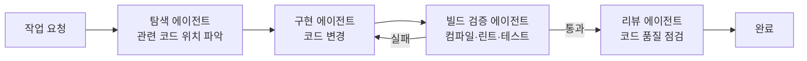
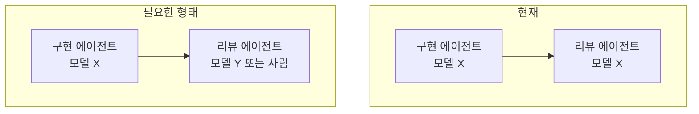
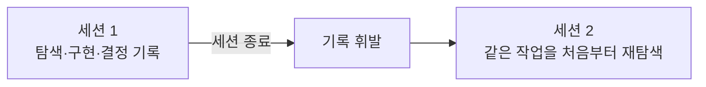

[앞선 글](/posts/gdg-korea-android-ai-tooling/)에 이어, 실제로 진행하고 있는 프로젝트에서 무엇이 제대로 구성되어 있고 또 어떤 부분이 필요한지 검사해봤습니다. 물론 보는 분들에 따라 다르게 느끼실 수도 있다고 생각합니다.

기준은 두 발표에서 그대로 가져왔습니다. Bonaldo의 "규칙을 코드가 아니라 문서로 외부화하고, 빌드-수정-검증 루프를 강제한다"와 하동현님의 "AI를 잘 쓰고 있다는 느낌은 결과·신뢰·비용·재현 네 축으로 쪼개서 검증해야 한다"는 두 가지입니다.

## 제대로 구성된 부분

### 1. 탐색 → 구현 → 검증 → 리뷰 파이프라인

작업 규모가 일정 이상이면(새 기능, 영향 범위가 넓은 변경) 4단계를 거치는 구조가 이미 있었습니다. 탐색 담당 에이전트가 먼저 관련 코드 위치를 찾고, 구현 담당이 그 결과만 보고 코드를 바꿉니다. 빌드 검증 담당이 컴파일·린트·테스트를 돌려 실패하면 되돌려 보내고, 마지막으로 리뷰 담당이 품질을 점검합니다.



이게 딱 Bonaldo가 말한 "**Build-Fix-Verify 루프**"입니다. 다만 작은 수정까지 이 파이프라인을 매번 태우면 오히려 느려서 개발자인 제가 직접 판단했을 때 단순한 수정은 이 루프를 생략하고 직접 처리하도록 규칙을 따로 뒀습니다. 원칙은 지키되 비용을 고려할 수 밖에 없었습니다.

### 2. 규칙의 문서화

색상 처리 방식, 로깅 방식, 커밋 메시지 형식처럼 반복해서 틀리기 쉬운 규칙은 프로젝트 루트의 가이드 문서에 명문화해뒀습니다. 예를 들면 이런 식입니다.

```
- 다크/라이트 모드 색상은 정적 리소스 참조가 아니라 런타임 색상 토큰으로 적용한다
- 주석은 명시적으로 요청받았을 때만 작성한다
- 텍스트 크기 단위는 sp가 아니라 dp를 쓴다
```

한 번 지적받은 실수가 다음 세션에서 반복되지 않는 이유가 여기 있습니다. Bonaldo가 강조한 "역할과 제약을 코드가 아니라 가드레일 문서로 못박는다"는 원칙과 같은 방향입니다. 사실 이 부분은 계속 작업을 진행하다보면 앞으로 계속 늘어날수도 있는 부분이라, 어떻게 저 집약적으로 정리할 수 있을지 고민은 더 필요하다고 생각합니다.

## 부족한 부분

### 1. 리뷰가 구현자 자신인 문제

파이프라인의 네 역할(탐색·구현·검증·리뷰)이 전부 같은 모델로 돌아갑니다. 자동 PR 리뷰 워크플로도 마찬가지로 같은 계열의 모델을 씁니다. 즉 코드를 짠 쪽과 그 코드를 검토하는 쪽이 같습니다.



하동현님 발표의 Adversarial review 원칙, 그리고 Bonaldo가 말한 "사람이 계획을 검토·승인한다"는 단계 모두 핵심은 다른 관점의 개입입니다. 같은 모델이 같은 편향으로 자기 결과물을 통과시킬 가능성을 스스로 걸러내기는 어렵습니다. 네 축 중 신뢰 축이 가장 약한 지점입니다.

저는 기존에 이 부분은 Sonnet이 다 해버리거나, Opus가 다 해버리는 거의 무의미한 루틴을 구성하고 있었습니다.
경우에 따라 중간 단계 버전으로 작업은 Sonnet, 평가 및 검증은 Opus가 하도록 처리할 수도 있겠습니다. (Opus가 더 하이 레벨이라 피드백에 철저하지 않을까 생각한 부분입니다.) 하지만 벤더 자체를 분리해서 작업은 Claude, 평가 및 검증은 Codex가 해보는 실험을 할 수 있겠습니다. 이미 프로젝트에서 클로드와 코덱스를 비교해가면서 테스트 중이었기 때문에 AGENTS.md(Codex 호환 미러) 또한 존재합니다. 이를 통해 실제 교차 리뷰 진입점으로 개선할 수 있어보입니다.

### 2. 세션 경계에서 휘발되는 작업 기록

파이프라인이 돌 때마다 탐색 결과, 구현 내역, 검증 결과를 작업 디렉터리에 단계별로 남기도록 설계돼 있습니다. 그런데 이 디렉터리가 버전 관리에서 제외되어 있어서 세션이 끝나면 그 기록도 같이 사라집니다. 



의도한 설계는 "다음 세션이나 다른 사람이 이 기록을 이어받아 왜 이런 결정을 내렸는지 알 수 있게 한다"는 것이었는데, 실제로는 그 목적을 달성하지 못하고 있습니다. 재현 축이 그대로 빠집니다. 사실 이 부분은 Notion, Confluence 문서화 및 그 문서들을 MCP로 연결하여 AI가 참조할 수 있도록 하는 것이 기존 제 생각이었습니다. 하지만 이 부분은 무엇보다 그 문서를 매번 땡겨올만큼 자원이 넉넉하느냐와 사용 빈도수가 높은지가 관건이었습니다. AI가 읽기 쉬운 md 파일로 계층별 문서화를 진행하고 그것을 읽도록 하는 것이 제일 적절할 수 있다는 생각이 들었습니다.


### 3. 실행 경로마다 다르게 관리되는 규칙 문서

저희 프로젝트는 두 가지 실행 환경(주 에이전트인 클로드용 규칙 파일과 다른 CLI 도구 호환을 위한 미러 파일)을 같이 씁니다. 미러 파일이 주 파일보다 며칠 뒤처져서 강화된 규칙(예: 주석 금지 규칙)이 한쪽에만 반영돼 있었습니다. 어느 진입점으로 들어오느냐에 따라 적용받는 규칙이 달라집니다. 이런 부분에 대해서도 놓치지 않고 동시에 처리하는 매커니즘을 구현해야합니다. 그래야 추후 다른 에이전트로의 이전 및 앞서 말씀드린 평가 검증 처리에서도 문제 없이 작업이 가능할 것으로 보입니다.

### 4. 연동은 있는데 쓰이지 않는 도구

이슈 트래커, 위키 같은 외부 도구가 에이전트와 연동은 돼 있지만 실제 세션에서 참조하거나 기록하는 빈도는 거의 0에 가까웠습니다... 판별 질문으로 따지면 "연동을 없애면 뭐가 달라지는가"에 "거의 아무것도 달라지지 않는다"고 답할 수밖에 없는 상태입니다. 인프라만 갖추고 축에는 기여하지 못하는 전형적인 사례입니다. 이런 부분들을 설치만 해둔 상태라면 현재 사내 Task에서 어떻게 효율성을 얻을 수 있을지 확인하는 시간이 필요해보입니다.

## 정리하며
이렇게 몇 가지 만족스럽지 못한 요소를 직접 찾아보고 대응 방안을 생각해봤는데, 제 생각이 잘못되었을수도, 또는 더 효율적인 대응 방안이 있을 수 있습니다.
앞으로도 도구 활용과 파이프라인 처리에 대해 더 고민하고 적용해봐야 진짜 AI를 사용할 줄 아는 개발자가 될 수 있다고 생각이 드는 시간이었습니다.
